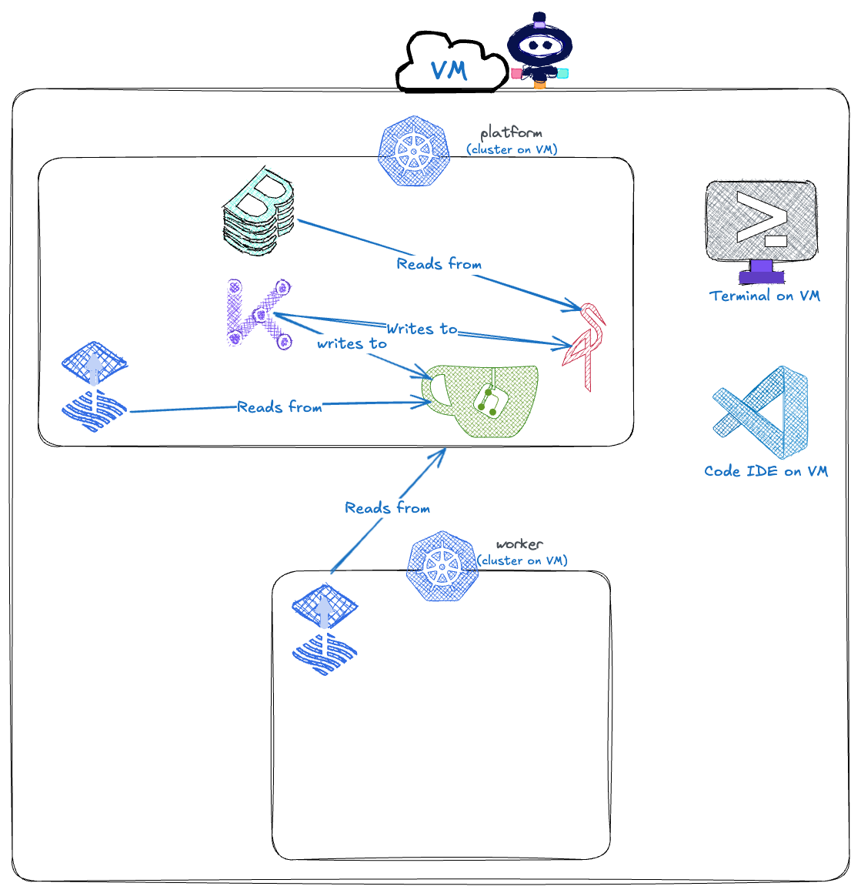

Welcome to a hackathon in a box. Let's get to know the environment 🗺️

👩🏾‍💻 First, the terminal
===

There are two pre-installed [KinD](https://kind.sigs.k8s.io/) Clusters.

* A `platform` cluster - this is where the centralised platform tools run
* A `worker` cluster - this is a destination where the platform schedules end-user workloads

See these local clusters:
```bash
kind get clusters
```

Each cluster can be accessed on the terminal by using the built-in environment variables:
```bash
kubectl get deployments -A --context $PLATFORM
```

This shows the additional platform tools that are installed to build all [three layers of successful internal tooling](https://www.syntasso.io/post/platform-engineering-orchestrating-applications-platforms-and-infrastructure):

* **[Cert Manager](https://cert-manager.io/)** - a certificate management tool for managing secure inter-service communication.
* **[Backstage](https://backstage.io/)** - a [portal interface](https://www.gartner.com/reviews/market/internal-developer-portals) to enable GUI interactions with the platform.
* **[Flux](https://fluxcd.io/)** - a [Gitops](https://www.cncf.io/blog/2022/08/10/add-gitops-without-throwing-out-your-ci-tools/) tool used for deployment of any platform resources.
* **[Gitea](https://about.gitea.com/)** - a self-hosted git repository that holds the declarative code for the platform.
* **[Kratix](https://kratix.io/)** - a platform orchestration tool used to build self-service, maintainable, and business-relevant APIs.
* **[MinIO](https://min.io/)** - a bucket storage tool that mimics s3 APIs, to hold Backstage configuration.



When viewing the worker cluster, there is much less running. More specifically, it's just Flux which deploys resources written by Kratix into Gitea:
```bash
kubectl get deployments -A --context $WORKER
```

🗂️ Now, the rest of the Instruqt Tabs
===

In each of the tabs along the top, the service should loaded up.

For example, navigate to the [Backstage tab](tab-1), where the authentication page can be found. For this workshop, there will only be a single guest user, so click on the `ENTER` button to enter the portal.

And then there is a [Gitea tab](tab-2) which uses the following login details:
* username:
  ```bash
  gitea_admin
  ```
* password:
  ```bash
  r8sA8CPHD9
  ```

Both of these applications will be used later in the workshop, so it is useful to complete the authentication now. While there, feel free to navigate around -- this is your personal environment!

> [!NOTE]
> Each step of the workshop is like a skin on top of a single virtual machine.
>
> This means there may be different tabs in each step, even if all the applications are running on the VM. Viewing only necessary applications helps to keep focused on the task at hand.
>
> But don't worry, the last step of the workshop is a complete setup with all of the possible tabs for unguided exploration!

🎁 Wrap up
===

So far, you have just gotten a sense of the local environment. It is good to see how many tools platform engineers have to manage and figuring out how to manage these in a sustainable way is an important part of having success!

Today's workshop has a narrow focus on building and delivering a hackathon powered by a self-service internal developer platform built with all OSS software. Even more, this solution is built within the Kubernetes ecosystem and leverages all the benefits of the Kubernetes to provide a robust and scalable solution out of the box.

The final UX will look like this:


To continue, just click on the `Check` button in the bottom right-hand corner.
