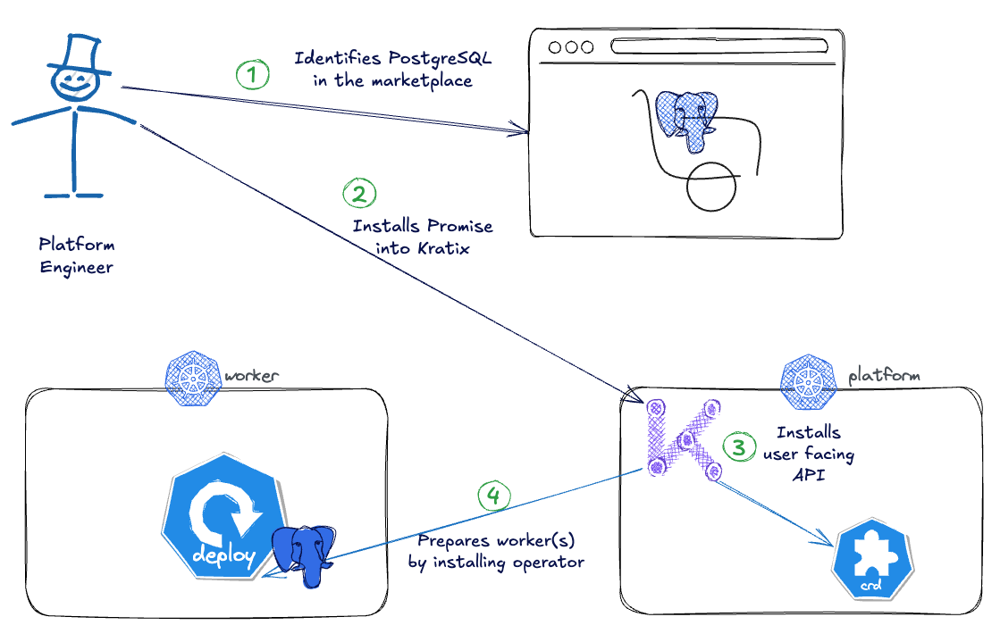
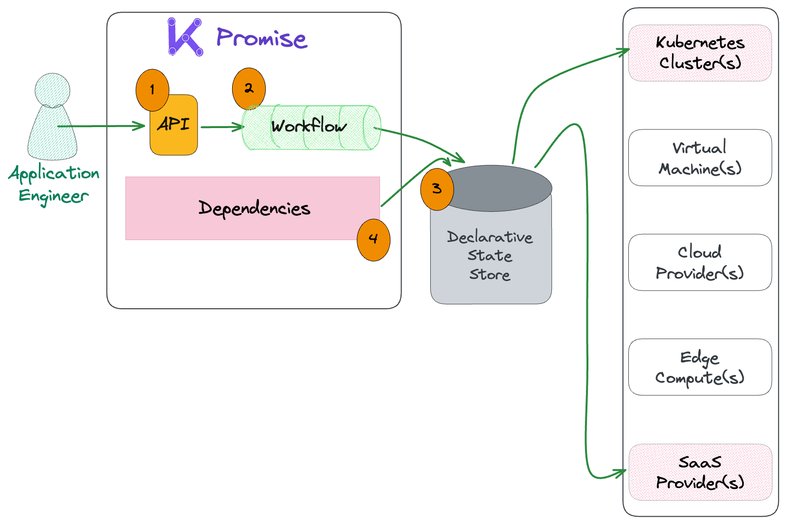
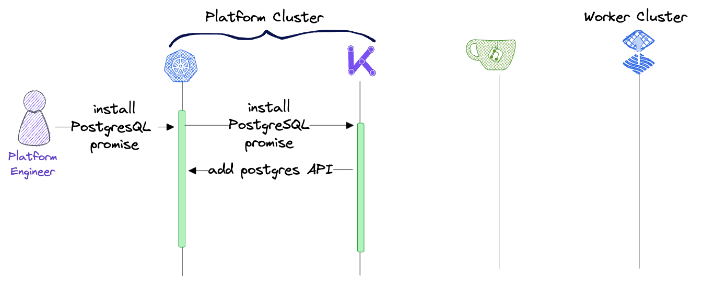
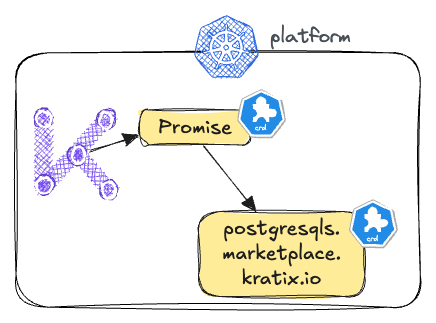
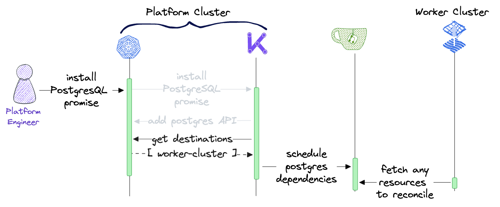
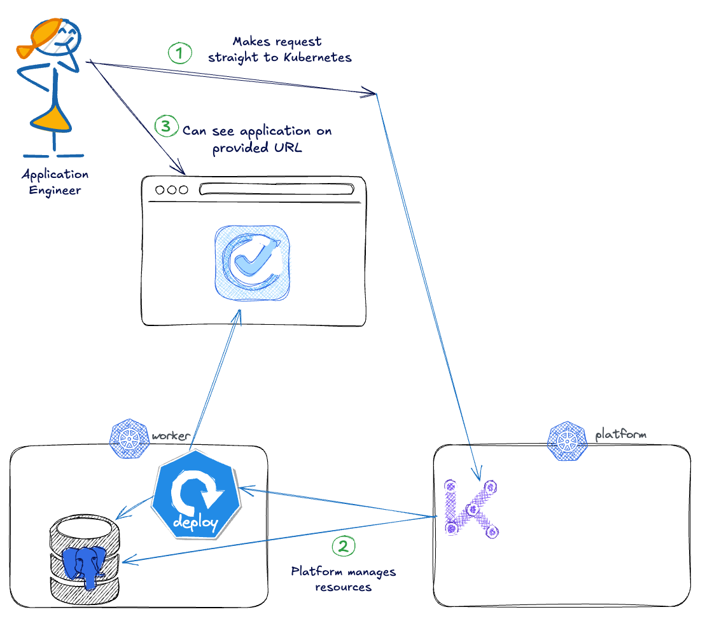

🧱 Building a self-service platform
===

The key paradigm shift from DevOps to Platform Engineering is the idea of providing something as a service ("X-as-a-service") rather than requiring each application team to build something themselves (or wait on a central provisioning team as we saw pre-DevOps!).

[Kratix](https://kratix.io) supports building self-service resources and can be used for applications as-a-service to support a Hackathon or general development. In the Kratix framework, each service is defined as a Promise. Like other packaging frameworks such as Docker or Helm, Kratix Promises can be shared in the community or custom-built. But unlike other packaging solutions, this is based on the Kubernetes API and uses CRDs and Controllers to create a dynamic, scalable, and robust platform.

So before diving into the details behind a Promise, let's use one from the community.

🐘 Installing PostgreSQL from the community
===

The [Kratix Marketplace](https://docs.kratix.io/marketplace) provides a suite of Promises to get started in the platform journey.

A hackathon application often depends on a database, so to install the Marketplace [PostgreSQL](https://github.com/syntasso/promise-postgresql) Promise, run the following command in the terminal:
```bash
kubectl --context $PLATFORM apply -f https://raw.githubusercontent.com/syntasso/promise-postgresql/main/promise.yaml
```

And that's it! This diagram shows the steps of a Promise installation, and to explore what these mean in more depth, continue to the next heading.




🔭 Exploring the Promise
===

A Promise CR is the building block that Kratix provides to enable platform teams to build their platforms incrementally. Promises are a custom resource that allow the platform to provide anything as-a-service and are composed of mainly three pieces:

* An **API (1)** exposing to the user of the platform the configuration options they have when requesting the service.
* A series of **Resource Workflows (2)** to execute which fulfil any requests made to the API.
* A set of **Dependencies(4)** that prepare any worker infrastructure intending to run the Promise workload.



Promises are defined as a Kubernetes [Custom Resource Definition (CRD)](https://kubernetes.io/docs/concepts/extend-kubernetes/api-extension/custom-resources/#customresourcedefinitions) and lay out a set of instructions that will produce a business approved resource whenever the Promise is invoked.

This means that when a Promise is installed, it uses the Kubernetes API to provide on-demand software and infrastructure (X-)as-a-service to users.

The structure of the Promise spec can be viewed with the following command:

```bash
kubectl --context $PLATFORM get promises postgresql -o yaml | \
  yq '.spec |  with_entries(.value |= keys)'
```

And of course the whole Promise can be viewed by removing the yq bit:
```bash
kubectl --context $PLATFORM get promises postgresql -o yaml
```

> [!NOTE]
> Learn more about what Promises are [here](https://docs.kratix.io/main/reference/promises/intro).


🧐 Viewing the API
===

When Promises are installed, the platform cluster is extended with a new API: the PostgreSQL Promise API. This API teaches the platform cluster how to respond to requests for PostgreSQL.

Kratix creates and manages the API from the Promise definition, as shown in the diagram below:



To see the API in the cluster, run the following command:

```bash
kubectl --context $PLATFORM get crds
```

This provides will include the newly created platform API as a CRD:

```bash,nocopy
...
postgresql.marketplace.kratix.io          2025-02-01T16:16:13Z
...
```

Many of the tools used today extend the Kubernetes API by creating CRDs. For example, Flux depends on CRDs in the `toolkit.fluxcd.io` and Kratix depends on in the `platform.kratix.io` package. Promises build on this pattern to provide platform APIs.



Leveraging the Kubernetes API provides a lot of built-in benefits, including self-documenting fields using the `explain` command:

```bash
kubectl --context $PLATFORM explain postgresql.spec
```


🔀 Tracing the dependencies
===

This Promise leverages the [Zalando Postgres Operator](https://github.com/zalando/postgres-operator) to provision each requested database. This means that the operator is a dependency for the Promise and will get installed by the Promise onto any destination (in this case, a K8s cluster) that can host a requested database.



But if there are dependencies, it may seem odd that the Promise doesn't have a `.spec.dependencies` key. That is because dependencies in Kratix can be provided in two ways:
1. Flat YAML files under the `dependencies` key
1. Dynamic containers under the `workflows.promise` key

Objects in both of these formats will be evaluated on Promise installation or change. While dynamic dependencies such as calculations, API validations, or templating must be done with the workflow, it is also best practice to use the `workflows.promise` options when there are more than a few YAML objects to print, as is the case with this operator.

First, see that the workflow has run:
```bash
kubectl --context $PLATFORM get pods -n kratix-platform-system -l kratix.io/promise-name=postgresql
```

Next, check the scheduling rules defined in the Promise and see how it will match to the `worker` destination by labels. This tells Kratix where to write any declarative code to enable smooth multi-cluster, multi-cloud, and even multi-architecture deployments:
```bash
kubectl get promises postgresql -ojsonpath='{.spec.destinationSelectors[0].matchLabels}'; echo
kubectl --context $PLATFORM get destinations --show-labels
```

Then, confirm these resources have been written to the correct [Gitea repository](tab-1). the Gitea tab will load to the `kratix` repo inside the `gitea_admin` user and, more specifically, to the `worker-cluster/dependencies` directory, which should have the directory `postgresql/promise-configure/5058f` added after Promise install.

The Zalando operator is the mechanism this platform depends on to deploy each requested database instance. Therefore, the operator definition is scheduled for deployment before any requests can be made.

> [!NOTE]
> Remember, the Gitea login details are:
> * username: `gitea_admin`
> * password: `r8sA8CPHD9`

Finally, while Kratix wrote these files to the correct git repository and directory, it is up to Flux on the worker cluster to deploy them. Verify that the operator was successfully installed in the worker cluster:

```bash
kubectl --context $WORKER get deployments
```

The output is similar to:
```bash,nocopy
NAME                READY   UP-TO-DATE   AVAILABLE   AGE
postgres-operator   1/1     1            1           30s
```


🎁 Wrap up
===

Upon completing this section of the workshop, your platform can now provide self-service postgres databases for app developers. You have focused on what it means to provide something "as-a-service".

While marketplace Promises help quickstart a platform, they are quite generic. This is common for shared tools as they need to be commonly applicable, but just like with other packaging tools, it is possible to combine, fork, and even extend these to include more unique requirements or create completely bespoke and private Promises.

For example, the workflows that manage both [imperative and declarative](https://ui.dev/imperative-vs-declarative-programming) commands mean specific business requirements such as security scans, sign-offs, and budget checks can all extend the marketplace Promise with ease.

Continue on to change hats and work as an app developer who may want to request a database from the platform creating this type of flow:


