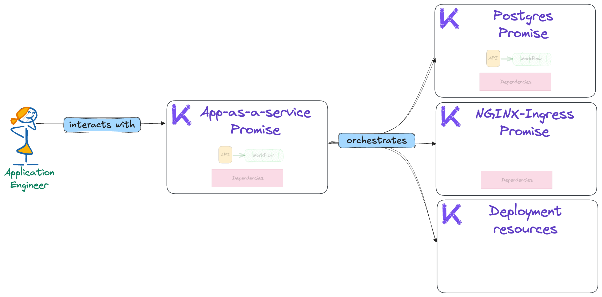
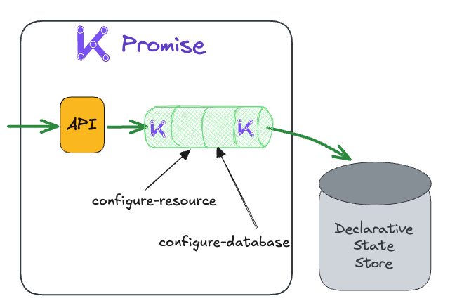
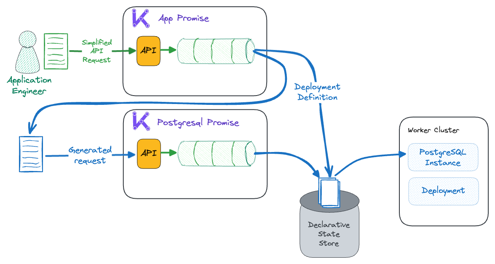

🏗️ Combining platform bricks into an application
===

Now that users can access databases, it is logical to think they will want to access those databases with a running application. This is where [Compound Promises](https://docs.kratix.io/blog/compound-promises) come into play. Allowing the platform to mix and match any number of existing Promises, into unique paved paths that provide higher level abstractions for users.

There is a basic `app-as-a-Service` Promise in the public marketplace that does just this. It generates some Kubernetes resources that depend on two other Promises to complete its work.



These dependencies are listed in the `promise.yaml` in the [Editor tab](tab-1) on lines 62-66.

The Postgres Promise was installed in the last section, and the [NGINX Ingress](https://docs.nginx.com/nginx-ingress-controller/) has since been added to the platform when installing the app-as-a-service Promise. The NGINX Promise is interesting, though, as the API columns in the Promise list are empty when this command is run in the [terminal tab](tab-0):

```bash
kubectl --context $PLATFORM get promises
```

That is because it doesn't have any user-facing API. In the case of this ingress controller, it is configured to expose any number of applications on a cluster. Therefore, it is a prerequisite for web-facing applications but isn't something a user would specifically need to request.

> [!NOTE]
> This is an example of where platforms must be able to manage resources of all shapes and sizes and configurations. Kratix is purpose-built to be flexible enough to support whatever services an organisation requires [regardless of the size complexity](https://www.syntasso.io/case-studies-how-natwest-uses-kratix-to-reduce-developer-cognitive-load).

🖼️ Building an application
===

The app-as-a-service Promise API is designed to make it easy for our users to interact with our platform to deploy a "Web app + Database". Use this command to create a Todo App:

```bash
cat << EOF | kubectl apply --context $PLATFORM -f -
apiVersion: marketplace.kratix.io/v1
kind: app
metadata:
  name: todoer
  namespace: default
spec:
  name: todoer
  image: syntasso/sample-todo-app:v1.0.0
  dbDriver: postgresql
  service:
    port: 8080

EOF
```

> [!NOTE]
> This todoer app is hard coded to support easy networking for the workshop. But in a more realistic environment this can really be anything!
>
> For exmaple. this app happens to be a simple python app, but really it could be anything that runs in a container and may use a postgres database.

The Promise is configured to run the following actions on resource creates and updates:

1. `configure-resource`: Create the K8s manifests for the app, with an nginx ingress.
2. `database-configure`: Create a Resource Request to the Postgres promise, and apply connection details to the container.



> [!NOTE]
> The Kratix logos in the workflow indicate the framework provides the start and end. Before each workflow, Kratix loads the triggering resource into the container, and at the end, it manages the writes to the statestore and status. These are auto-injected by the framework, so platform engineers don't need to think about them!

To further explore this Promise, navigate to the [Editor tab](tab-1) and view the resource configure pipelines on lines 68-81 in the `promises.yaml`.
The scripts referred to as the commands can be found in the `/internal/configure-pipeline/scripts` folder

To check the status of our app deployment, run this [terminal](tab-0) command:

```bash
kubectl --context $PLATFORM get apps
```

👀 Viewing the Application
===

The [`App UI` tab](tab-3) is configured to view this URL. The app and its database do take time to start up, sometimes ~2 minutes. So if the tab is showing an error page, refresh the browser window using the icon to the top right of the page after a bit of time.

👩‍💻 Review the Promise
===

The power of compound promises allows users to stop manually wiring together services and instead receive deep value through the use of intelligent and collaborative dependencies. This can be seen in the [editor tab](tab-1) on lines 57-85 of `internal/configure-resources/scripts/database-configure` file.

This doesn't add significant platform overhead as it simply makes a request to the postgres promise just like a user would, which is in the same script on lines 37-48.



To confirm the promise request, look at the list of `postgresqls` currently scheduled. View `postgresqls` with the following command in the [terminal](tab-0):

```bash
kubectl --context $PLATFORM get postgresqls
```

Output will now have two instances listed:

```bash,nocopy
NAME       STATUS
example    1Gi instance v16
todoerdb   1Gi instance v16
```

To view the Deployment's environment variables run the following command:

```bash
kubectl --context $WORKER get deployment todoer -o yaml | yq .spec.template.spec.containers[0].env
```

Environment variables `PGHOST`, `PGUSER`, `PGPASSWORD`, and `DBNAME` are automatically configured by the app-as-a-service Promise.

🎁 Wrap up
===

This section of the workshop has now enabled application developers to manage their applications with an ingress-exposed endpoint by only providing a Docker image and a few pieces of information. This was enabled by composing multiple lower-level services into a larger paved path Promise.

Importantly, this approach means that if (or more realistically when) a user needs more configuration, they can stay on the platform even if they choose not to use the paved path by leveraging the lower-level Promise constructs.

Next, it's time to look at how to make this generic marketplace Promise into something that is ready for a specific organisation with specific requirements and business polocies.
