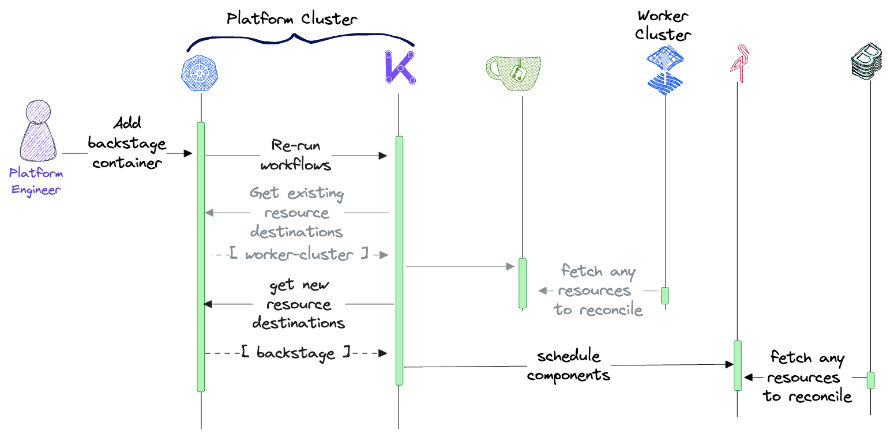
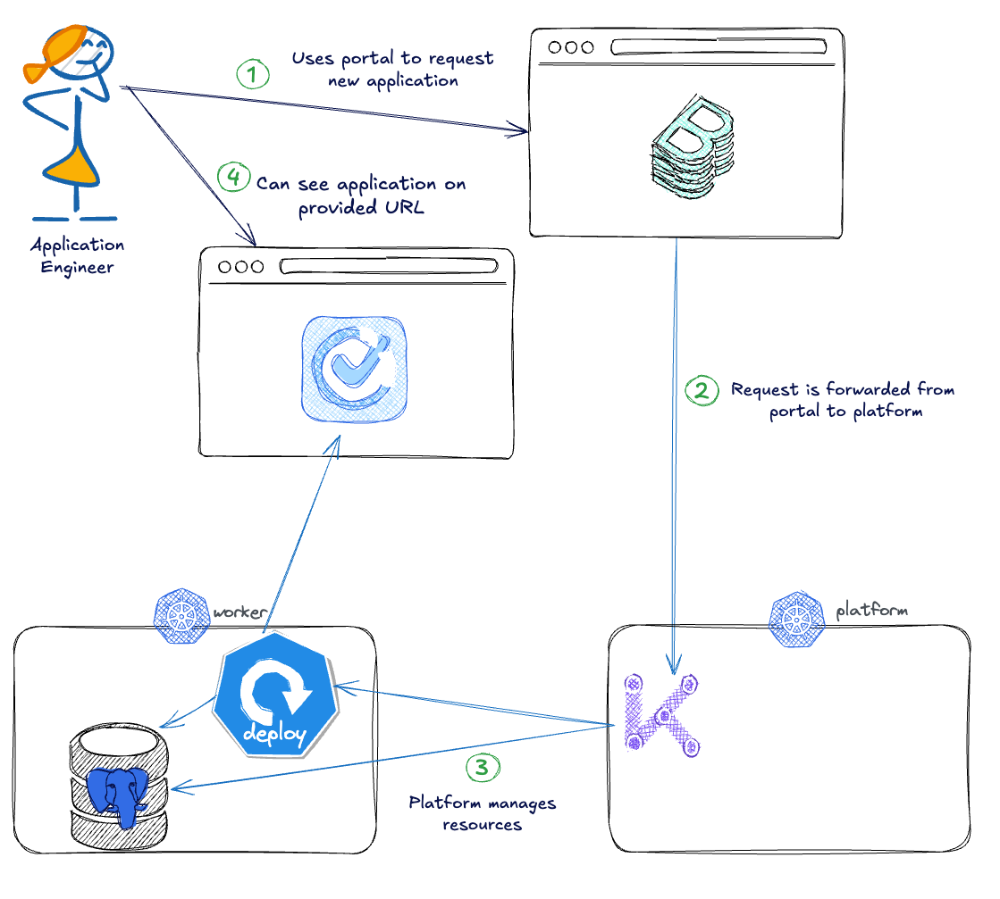

😌 Time for a better UX
===

Welcome to the new home for app developer platform actions, the Backstage Portal.

Step one is to authenticate. For this workshop, there will only be a single guest user, so if there is an authentication page showing, click on the `ENTER` button to enter the portal.

As with a web application, portals are only as powerful as the tools behind them. And so far this Backstage is unaware of the Kratix App API that has been created. To fix this, Backstage needs to be taught about the API.

🫱🏾‍🫲🏼 Backstage, meet the App API
===

Backstage uses YAML to define its components. Since the Promise workflow can output any files to a statestore, including non-Kubernetes YAML, the workflow can be used to generate Backstage components and then store them in a Backstage compatible state store such as a [minio](https://min.io/) bucket.

> [!NOTE]
> Per [OpenGitOps](https://opengitops.dev/), a state store is a system for storing immutable versions of desired state declarations. This state store should provide access control and auditing on the changes to the desired state. Git, from which GitOps derives its name, is the canonical example used as this state store, but any other system that meets these criteria may be used. In all cases, these state stores must be properly configured, and precautions must be taken to comply with the requirements set out in the GitOps Principles.

The container logic is quite simple actually as it transforms the details from the Promise into the format Backstage requires. To view this, navigate to the [editor tab](tab-2) and look at the `internal > backstage > resources` directory. It is just a set of YAML resources with the context of this API.

To add this container to the existing Promise workflow, navigate to the [terminal tab](tab-1) and use the following command:
```bash
yq eval '.spec.workflows.promise.configure[0] += {
    "apiVersion": "platform.kratix.io/v1alpha1",
    "kind": "Pipeline",
    "metadata": {"name": "promise-configure"},
    "spec": {
      "containers": [{
        "image": "kubecon-workshop/backstage:dev",
        "name": "backstage",
        "command": ["promise-configure"]
      }]
    }
  } | .spec.workflows.resource.configure[0].spec.containers += [{
  "image": "kubecon-workshop/backstage:dev",
  "name": "backstage",
  "command": ["resource-configure"]
}]' -i ${HOME}/hackathon/app-as-a-service/promise.yaml
```

Now return to the [editor tab](tab-2) and look at the `promise.yaml` file in the root (and don't forget to refresh if it was already open!) to view the updated workflows starting on line 74. The Promise workflow that creates the scaffold objects and the resource workflow will also create the catalog entries per user request.

With that added to the Promise navigate back to the [terminal tab](tab-1) and apply the new promise with:
```bash
kubectl apply -f $HOME/hackathon/app-as-a-service/promise.yaml
```

and see the workflows being applied:
```bash
kubectl get po -Aw -l kratix.io/promise-name=app
```



> [!NOTE]
> The pod in the `kratix-platform-system` namespace is the Promise level workflow, and the one in the same namespace as the todo app (`default`) is the resource level workflow.

😌 Viewing the portal update
===

With the Promise configured to speak to and configure Backstage, navigate back to the [Backstage tab](tab-0) and have a look. The page may need to be refreshed using the circular-looking icon near the top right of the embedded browser window.

Once refreshed, there should be a number of components in the catalog, as well as the option to add a new component using the button on the top right.

Click the `create` button and there will now be an option to scaffold an App resource directly from the UI. Follow the instructions to create a new app with any valid inputs.

For example:
* name: `kubecon`
* image: `syntasso/sample-todo-app:v2.0.0`


🤖 Platform execution time
===

Once a request is submitted from Backstage, it will apply that request to the configured Kubernetes cluster using a community-created [backstage scaffolder kubernetes plugin](https://github.com/kirederik/backstage-k8s-scaffolder-actions).

To see this request, navigate to the [terminal tab](tab-1) and get a list of apps:
```bash
kubectl --context $PLATFORM get apps
```

This will now list any apps that have been created, either through Kubernetes directly, from the Backstage portal, or any other method. This is the platform source of truth while still showing the same information in UIs like Backstage because of the Promise update!

🎁 Wrap up
===

In this section of the workshop, a custom Backstage plugin that can commit to a Kubernetes cluster was used to make requests to the platform APIs for users who wanted a more visual interface. But instead of needing to create bespoke logic for each and every interface, the platform can expose its APIs and reduce maintenance for updates across the user experience. And that means the complete goal architecture is in place!



> [!NOTE]
> This is another great example of where a platform can be more durable and resilient if you enhance this setup to speak to Git rather than the cluster directly.

Speaking of maintenance, the only concern left is what happens when people do such great things that these hackathon applications need to go to production and the single replica example apps aren't reliable enough. But don't worry, that will be tackled in the next section!
